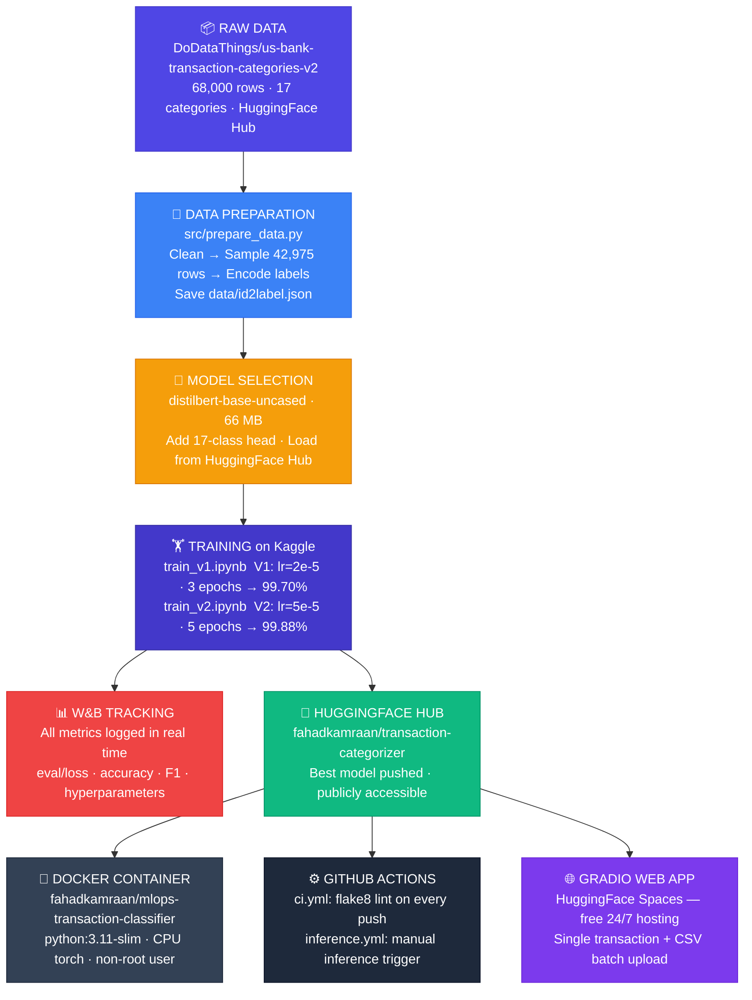

# Transaction Categorizer

[](https://github.com/S-FK/transaction_categorization/actions/workflows/ci.yml)
[](LICENSE)
[](https://huggingface.co/fahadkamraan/transaction-categorizer)
[](https://huggingface.co/spaces/fahadkamraan/transaction-categorizer-demo)

End-to-end MLOps pipeline that fine-tunes **DistilBERT** on real bank transaction
descriptions to classify them into **17 merchant spending categories** — achieving **99.88% test accuracy**.

> IIT Jodhpur · M.Tech AI · ML Ops — CSL 7040

---

## Live Demo

**Try it instantly — no setup needed:**
🌐 **[https://huggingface.co/spaces/fahadkamraan/transaction-categorizer-demo](https://huggingface.co/spaces/fahadkamraan/transaction-categorizer-demo)**

- Paste any bank transaction description → get predicted category + confidence
- Upload a CSV bank statement → categorise every row in one click
- Sample file: [`test_transactions.csv`](app/test_transactions.csv) (49 real-style transactions)

---

## Project Links

| Resource | Link |
|---|---|
| GitHub Repository | https://github.com/S-FK/transaction_categorization |
| Kaggle Notebook — V1 | https://www.kaggle.com/code/fahadkamraaniitj/train-v1 |
| Kaggle Notebook — V2 | https://www.kaggle.com/code/fahadkamraaniitj/train-v2 |
| HuggingFace Model | https://huggingface.co/fahadkamraan/transaction-categorizer |
| Docker Image | https://hub.docker.com/r/fahadkamraan/mlops-transaction-classifier |
| W&B Dashboard | https://wandb.ai/fahadkamraan_sfk/mlops-transaction-classifier |
| Web Demo (Gradio) | https://huggingface.co/spaces/fahadkamraan/transaction-categorizer-demo |

---

## Dataset & Model

| | |
|---|---|
| **Dataset** | [`DoDataThings/us-bank-transaction-categories-v2`](https://huggingface.co/datasets/DoDataThings/us-bank-transaction-categories-v2) · MIT licence |
| **Task** | 17-class bank transaction merchant categorisation |
| **Subset** | 42,975 samples — up to 3,000 per class × 17 classes |
| **Model** | [`distilbert-base-uncased`](https://huggingface.co/distilbert/distilbert-base-uncased) · 66 MB |
| **Best Accuracy** | **99.88%** test accuracy (V2) |

---

## Team

| Name | Roll No. | GitHub |
|---|---|---|
| S Fahad Kamraan | G25AIT2091 | @s-fk |
| Dhruvi Patel | G25AIT2030 | @dhruvi9660 |
| Mahesh V | G25AIT2058 | @maheshv2058-iitj |
| Himanshu Choubey | G25AIT2039 | @g25ait2039-uid |

---

## How It Works — Pipeline Overview

The project builds a complete, production-style MLOps pipeline. Here is how every component connects:



### What each component does

| Component | What it is | What it does in this project |
|---|---|---|
| **HuggingFace Hub** | GitHub for AI models — stores weights, tokenizers, configs | Hosts our raw dataset and the trained model; inference loads from here at runtime |
| **Kaggle** | Cloud notebook platform with free GPU | Where training runs — GPU T4 x2, ~25 min per notebook |
| **W&B (Weights & Biases)** | Experiment tracking platform | Logs every metric, hyperparameter, and run in real time; enables V1 vs V2 comparison |
| **Docker** | Container platform — packages app + dependencies | Makes inference portable; anyone can run the model with one command, no setup |
| **GitHub Actions** | CI/CD automation built into GitHub | Runs flake8 lint on every push; triggers inference on demand via the web UI |
| **Gradio** | Python library: turns a function into a web UI | 10 lines of code → full interactive web app with tabs, file upload, confidence charts |
| **HuggingFace Spaces** | Free cloud hosting for Gradio/Streamlit apps | Runs our Gradio app 24/7 at a public URL — no server needed from us |

---

## What Happens When Data Changes?

The pipeline has a clear **cut point** at the HuggingFace Hub push:

```
DATA CHANGES
     │
     │  ← MANUAL (you do these)
     ▼
  1. Edit src/prepare_data.py  →  re-run  →  new CSVs
  2. Re-run notebooks on Kaggle (V1 and V2)
  3. New model pushed to HuggingFace Hub
     │
     │  ← AUTOMATIC (happens on its own)
     ▼
  Gradio Space  ─┐
  Docker run    ─┼─ all load the model from HF Hub at runtime
  GitHub Actions─┘  → pick up the new model with zero redeployment
```

Because inference loads the model **at runtime from HF Hub** (not baked into the image), updating the model automatically updates all three consumers. To retrain with new data: re-run the notebooks → push new weights → done.

---

## MLOps Maturity

This project sits at **Level 1** on the MLOps maturity scale:

```
Level 0        Level 1 ← WE ARE HERE     Level 2              Level 3
──────────     ────────────────────────   ──────────────────   ──────────────────────
Jupyter        Scripts + Git + W&B        CI/CD triggers        Feature store +
notebooks      HF Hub + Docker +          retraining on         drift monitoring +
only           GitHub Actions +           data change +         auto-rollback +
               Gradio demo               model registry        A/B testing
```

---

## Quick Start

```bash
git clone https://github.com/S-FK/transaction_categorization.git
cd transaction_categorization
python -m venv venv && source venv/bin/activate
pip install -r requirements.txt
```

### Prepare data
```bash
python src/prepare_data.py
# outputs: data/id2label.json  +  data/processed/{train,val,test}.csv
```

### Verify model loads
```bash
python src/load_model.py
```

### Train on Kaggle
Upload `notebooks/train_v1.ipynb` and `notebooks/train_v2.ipynb` to Kaggle.
Add `WANDB_API_KEY` and `HF_TOKEN` as Kaggle Secrets. See [CONTRIBUTING.md](CONTRIBUTING.md).

### Docker inference
```bash
docker build \
  --build-arg HF_MODEL_NAME=fahadkamraan/transaction-categorizer \
  -t fahadkamraan/mlops-transaction-classifier:latest .

docker run --rm \
  -e HF_TOKEN=<token> \
  -e INPUT_TEXT="starbucks coffee purchase" \
  fahadkamraan/mlops-transaction-classifier:latest
```

### GitHub Actions Inference
**Actions → Inference → Run workflow** → enter any transaction string.

---

## Repository Structure

```
transaction_categorization/
├── .github/
│   ├── workflows/
│   │   ├── ci.yml               # Lint on push to develop
│   │   └── inference.yml        # Manual inference trigger
│   ├── CODEOWNERS               # Auto-assigns reviewers
│   └── PULL_REQUEST_TEMPLATE.md
├── app/
│   ├── app.py                   # Gradio web app (deployed on HF Spaces)
│   ├── requirements.txt         # Spaces deps
│   ├── test_transactions.csv    # 49 sample transactions for demo
│   └── sample_bank_statement.csv# Same 49 with ground truth labels
├── data/
│   └── id2label.json            # 17-class label map (only committed file)
├── docs/                        # Report, screenshots, diagrams
├── notebooks/
│   ├── train_v1.ipynb           # Kaggle training — V1 hyperparameters
│   └── train_v2.ipynb           # Kaggle training — V2 hyperparameters
├── src/
│   ├── prepare_data.py          # Data pipeline: download, clean, sample, save
│   ├── load_model.py            # Load tokenizer + model from HF Hub
│   └── inference.py             # Inference: used by Docker + Actions + Gradio
├── Dockerfile                   # CPU-only inference container
├── requirements.txt             # Full training deps (pinned)
└── requirements-inference.txt   # Slim inference-only deps
```

---

## Branching Strategy

```
main      ← protected · submission state · PR from develop only
  └── develop  ← protected · default branch · CI runs here
        └── feature/<description>  ← where all work happens
```

See [CONTRIBUTING.md](CONTRIBUTING.md) for branch naming, commit format, and PR rules.

---

## GitHub Secrets Required

| Secret | Purpose |
|---|---|
| `HF_TOKEN` | Pull model from HuggingFace Hub in Actions |
| `WANDB_API_KEY` | Log metrics to W&B (set in Kaggle Secrets too) |
