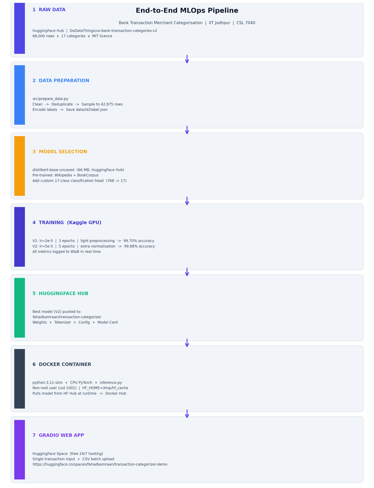
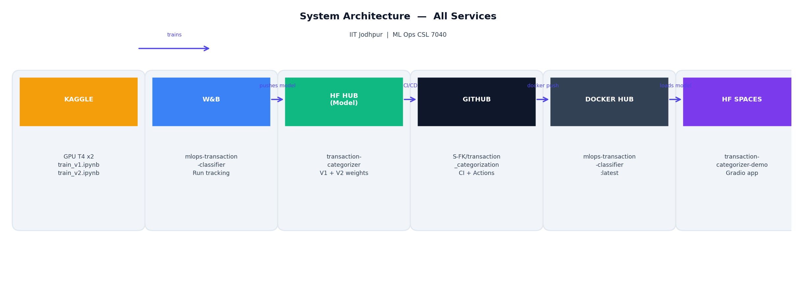
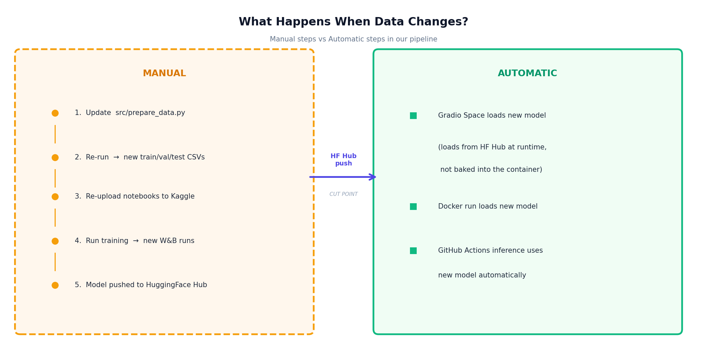
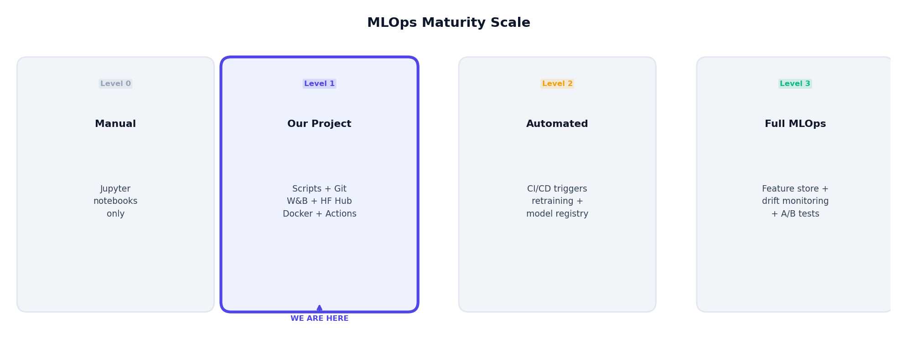
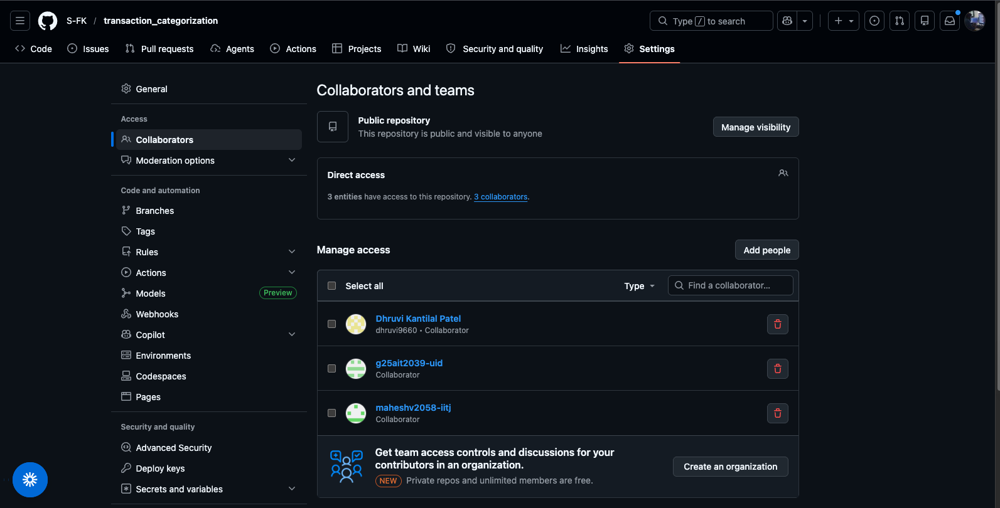
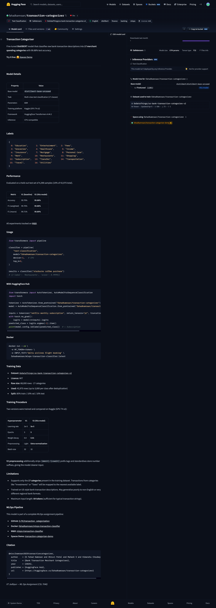
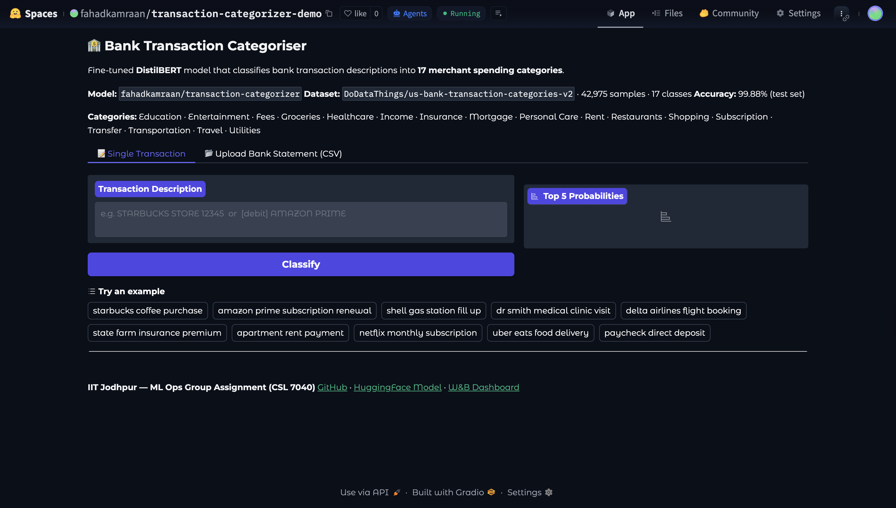
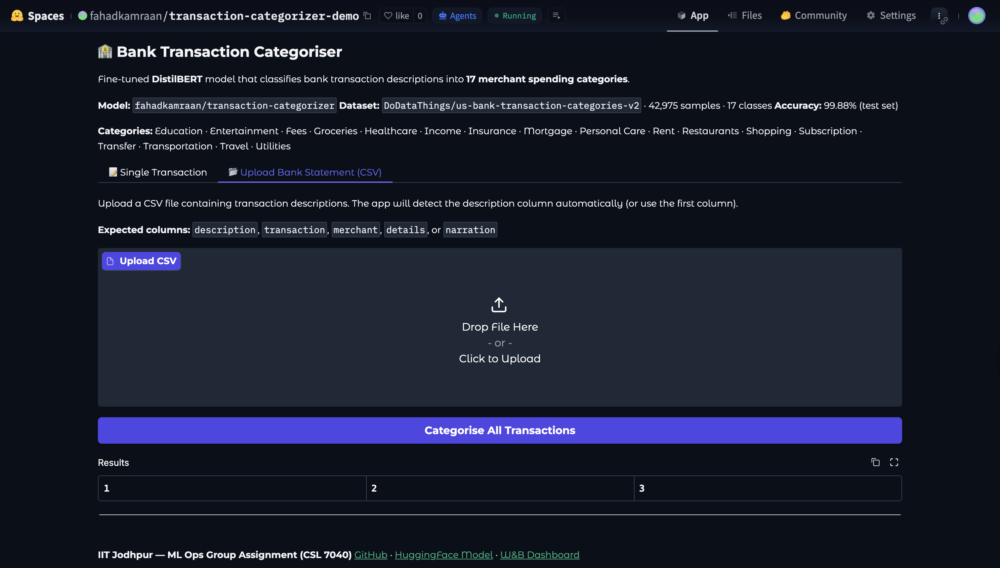
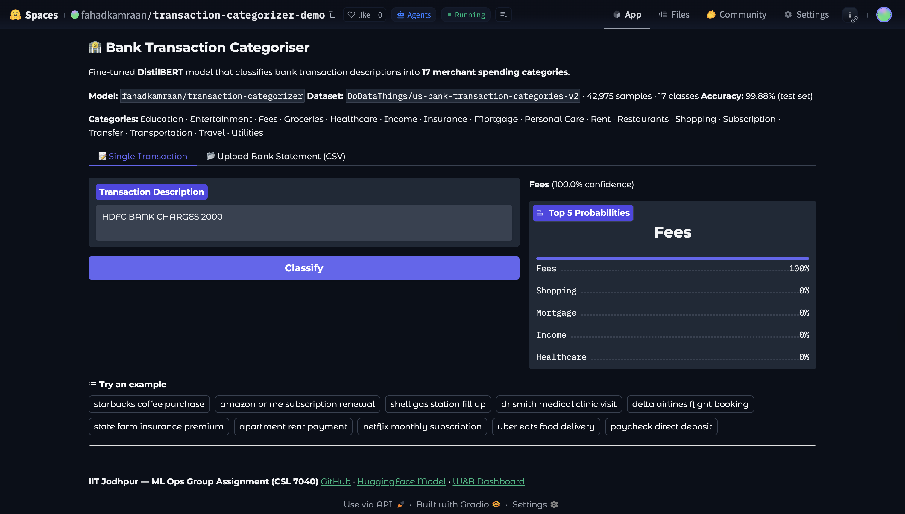
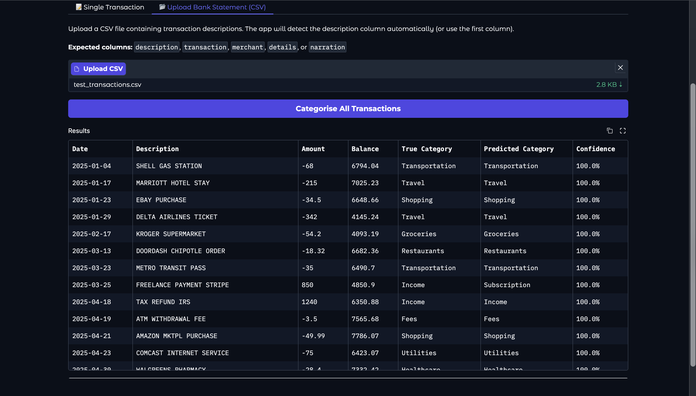

# MLOps Group Project Report
## End-to-End MLOps Pipeline: Bank Transaction Merchant Categorisation

**Institution:** IIT Jodhpur — M.Tech Artificial Intelligence (PGD AI)
**Course:** ML Ops — CSL 7040 | **Total Marks:** 100

---

## Team & Contributions

| Name | Roll No. | GitHub | Contribution |
|---|---|---|---|
| S Fahad Kamraan | G25AIT2091 | @s-fk | GitHub setup, CI/CD, Dockerfile, inference script, GitHub Actions, Docker Hub, end-to-end integration |
| Dhruvi Patel | G25AIT2030 | @dhruvi9660 | Data preparation, cleaning pipeline, label encoding |
| Mahesh V | G25AIT2058 | @maheshv2058-iitj | Kaggle training, W&B tracking, HuggingFace model push |
| Himanshu Choubey | G25AIT2039 | @g25ait2039-uid | Report preparation and documentation |

---

## Project Links

| Resource | Link |
|---|---|
| GitHub Repository | https://github.com/S-FK/transaction_categorization |
| HuggingFace Model | https://huggingface.co/fahadkamraan/transaction-categorizer |
| Kaggle Notebook — V1 | https://www.kaggle.com/code/fahadkamraaniitj/train-v1 |
| Kaggle Notebook — V2 | https://www.kaggle.com/code/fahadkamraaniitj/train-v2 |
| Docker Image | https://hub.docker.com/r/fahadkamraan/mlops-transaction-classifier |
| W&B Dashboard | https://wandb.ai/fahadkamraan_sfk/mlops-transaction-classifier |
| Live Gradio Demo | https://huggingface.co/spaces/fahadkamraan/transaction-categorizer-demo |

---

## Pipeline Overview

The project implements a complete, production-style MLOps workflow. Every component is automated or reproducible — data is versioned on HuggingFace Hub, experiments are tracked on W&B, the best model is published to HuggingFace Hub, and inference is served three ways simultaneously.


*End-to-end pipeline flow — raw data through to inference*


*System architecture — all components and their connections*


*How data updates propagate through the pipeline — Gradio, Docker, and GitHub Actions all reload automatically from HuggingFace Hub*


*MLOps maturity level — Level 1 (Scripts + Git + W&B + HF Hub + Docker + GitHub Actions + Gradio demo)*

---

## Task 1 — GitHub Repository Setup

Repository: **https://github.com/S-FK/transaction_categorization** (public)

### Branch Strategy

- **main** — protected production branch; accepts only PRs from `develop`, requires 1 approval + CI passing
- **develop** — protected integration branch (default); all feature work merged here first via PR
- **feature/* / fix/* / docs/* / chore/*** — short-lived working branches

**CODEOWNERS** auto-assigns reviewers per file path. All secrets (`HF_TOKEN`, `WANDB_API_KEY`) are stored in GitHub Actions Secrets — never hardcoded.


*All 3 team members added with Write access*


*Branch protection rulesets overview*


*main branch ruleset — requires PR + CI pass*


*develop branch ruleset — protected integration branch*

---

## Task 2 — Data Preparation & Normalisation

### Dataset

| Property | Value |
|---|---|
| Source | [DoDataThings/us-bank-transaction-categories-v2](https://huggingface.co/datasets/DoDataThings/us-bank-transaction-categories-v2) |
| Licence | MIT |
| Raw size | 68,000 rows |
| Used subset | 42,975 rows — up to 3,000 per class × 17 classes |
| Columns | `description` (text), `category` (label) |
| Split | 80% train (34,380) / 10% val (4,297) / 10% test (4,298) |

### Raw Data Inspection

On loading, the dataset had 68,000 rows across 17 merchant categories with no missing values and 22,298 duplicate rows. After deduplication, some categories had fewer than 3,000 unique samples (Fees: 1,349; Mortgage: 1,680; Rent: 1,908) so those were sampled as-is, giving 42,975 total. Description length ranged from 3 to 120 characters (mean ~28 chars), confirming DistilBERT's `max_length=64` tokenisation window covers the vast majority without truncation.

### Class Distribution after Stratified Sampling

| Category | Samples | Category | Samples |
|---|---|---|---|
| Groceries | 3,000 | Transfer | 2,869 |
| Transportation | 3,000 | Travel | 2,740 |
| Insurance | 3,000 | Personal Care | 2,620 |
| Shopping | 3,000 | Healthcare | 2,544 |
| Restaurants | 3,000 | Entertainment | 2,497 |
| Utilities | 3,000 | Subscription | 2,435 |
| Income | 2,239 | Education | 2,094 |
| Rent | 1,908 | Mortgage | 1,680 |
| Fees | 1,349 | | |

### Cleaning Decisions

| Noise Pattern | Example | Decision | Reason |
|---|---|---|---|
| Alphanumeric reference codes | `AMAZON MKTPL*K8R2M5VN7` | Stripped with `\b[A-Z0-9]{6,}\b` | Transaction-unique IDs add no categorical signal |
| Mixed case | `Starbucks` vs `STARBUCKS` | Lowercased | DistilBERT uncased tokeniser requires lowercase |
| Special characters | `WALMART #4521 *` | Collapsed to space | Formatting artefacts with no semantic meaning |
| Multiple whitespace | `UBER   EATS` | Collapsed to single space | Prevents extra spaces from fragmenting tokens |
| `[debit]`/`[credit]` prefix (V2) | `[debit] STARBUCKS` | Stripped | Indicates transaction direction, not merchant type |
| Store number suffixes (V2) | `TARGET STORE 1234` | Standardised | Location-specific numbers fragment merchant tokens |

Only `data/id2label.json` is committed to git — all CSV splits are excluded via `.gitignore`.

### Label Encoding

17 categories sorted alphabetically, assigned integer IDs 0–16, saved to `data/id2label.json`.

**Categories:** Education · Entertainment · Fees · Groceries · Healthcare · Income · Insurance · Mortgage · Personal Care · Rent · Restaurants · Shopping · Subscription · Transfer · Transportation · Travel · Utilities

---

## Task 3 — Model Selection: `distilbert-base-uncased`

We selected [`distilbert-base-uncased`](https://huggingface.co/distilbert/distilbert-base-uncased) (Sanh et al., 2019). DistilBERT is a distilled version of BERT that retains 97% of BERT's language understanding on GLUE benchmarks while being 40% smaller (66 MB vs 110 MB) and 60% faster at inference. The uncased variant suits bank transaction descriptions — typically all-uppercase — that benefit from case normalisation. Unlike larger models such as RoBERTa-large or GPT-2, DistilBERT trains comfortably within Kaggle's free GPU T4 quota in under 30 minutes and stays well within the 200 MB size guideline. Pre-training on BookCorpus and English Wikipedia (masked LM) gives strong lexical coverage for merchant names and category keywords. A 17-class classification head (768 → 17 linear layer) was added and the full model was fine-tuned end-to-end.

---

## Task 4 — Training Experiments

Both experiments were run on **Kaggle** (GPU T4 x2) using the HuggingFace `Trainer` API with `report_to='wandb'`. `WANDB_API_KEY` and `HF_TOKEN` were stored as **Kaggle Secrets** — never hardcoded in the notebook.

### Hyperparameter Comparison

| Hyperparameter | V1 (run-v1) | V2 (run-v2) |
|---|---|---|
| Learning rate | 2e-5 | 5e-5 |
| Epochs | 3 | 5 |
| Weight decay | 0.0 | 0.01 |
| Batch size (per device) | 32 | 32 |
| Preprocessing | Light clean | Extra normalisation (strips [debit]/[credit], standardises store numbers) |
| Early stopping patience | 2 | 2 |
| fp16 | Yes (GPU) | Yes (GPU) |

### Results

| Metric | V1 (run-v1) | V2 (run-v2) | Winner |
|---|---|---|---|
| Test Accuracy | 99.70% | **99.88%** | V2 ↑ 0.18pp |
| Test F1 (weighted) | 99.70% | **99.88%** | V2 ↑ 0.18pp |
| Test F1 (macro) | 99.71% | **99.89%** | V2 ↑ 0.18pp |


*W&B Dashboard — both runs tracked (eval/loss, eval/f1_weighted, eval/f1_macro). V2 shows lower loss and higher F1 at every epoch.*

### Observations

V2 outperformed V1 across all metrics due to three factors:

1. **Extra normalisation** — stripping `[debit]`/`[credit]` prefix tags and standardising store number suffixes gave the model cleaner, more generalisable input (e.g. `TARGET STORE 1234` and `TARGET STORE 5678` collapse to the same token sequence).
2. **Higher learning rate (5e-5 vs 2e-5)** — DistilBERT's randomly-initialised classification head benefits from a higher rate to converge faster on task-specific representations.
3. **Weight decay (0.01)** — L2 regularisation reduced overfitting slightly; V2 shows no per-class F1 below 0.99, whereas V1 had a few at 0.98.

---

## Task 5 — HuggingFace Model

The best-performing model (V2) was pushed to HuggingFace Hub at the end of `train_v2.ipynb`:

```python
model.push_to_hub('fahadkamraan/transaction-categorizer')
tokenizer.push_to_hub('fahadkamraan/transaction-categorizer')
wandb.run.summary['huggingface_model'] = \
    'https://huggingface.co/fahadkamraan/transaction-categorizer'
```

**Model URL:** https://huggingface.co/fahadkamraan/transaction-categorizer


*Model card at huggingface.co/fahadkamraan/transaction-categorizer — 17-class fine-tune of distilbert-base-uncased, 99.88% test accuracy*

---

## Task 6 — Docker Inference Container

### Dockerfile Design

```dockerfile
FROM python:3.11-slim
ARG HF_MODEL_NAME=fahadkamraan/transaction-categorizer
ENV HF_MODEL_REPO=${HF_MODEL_NAME} \
    HF_HOME=/tmp/hf_cache
RUN groupadd --gid 1001 appgroup \
 && useradd --uid 1001 --gid appgroup --no-create-home appuser
WORKDIR /app
COPY requirements-inference.txt .
RUN pip install --no-cache-dir \
      --extra-index-url https://download.pytorch.org/whl/cpu \
      -r requirements-inference.txt
COPY src/inference.py .
USER appuser
CMD ["python", "inference.py"]
```

| Design Decision | Reason |
|---|---|
| `python:3.11-slim` base | Minimal OS footprint; no build tools needed for inference |
| CPU-only PyTorch (`torch==2.7.1+cpu`) | Single-transaction inference needs no GPU; keeps image under 1 GB |
| `ARG HF_MODEL_NAME` | Any fine-tuned model repo can be swapped in at build time |
| `HF_HOME=/tmp/hf_cache` | Non-root user has no home directory; `/tmp` is always writable |
| Non-root `appuser` (uid 1001) | Security best practice — process cannot escalate or write to system paths |
| Secrets via env vars only | `HF_TOKEN` and `INPUT_TEXT` passed at `docker run` time; never baked into the image |

**Docker Hub:** https://hub.docker.com/r/fahadkamraan/mlops-transaction-classifier

### Successful Local Inference — 20 Test Cases

The model was tested locally with 20 representative bank transaction descriptions spanning all 17 categories:

| Transaction Description | Predicted Category | Confidence | Notes |
|---|---|---|---|
| starbucks coffee purchase | Restaurants | 1.0000 | |
| amazon prime subscription | Subscription | 1.0000 | |
| shell gas station fill up | Transportation | 1.0000 | |
| dr smith medical clinic visit | Healthcare | 1.0000 | |
| whole foods market groceries | Groceries | 1.0000 | |
| netflix monthly subscription | Subscription | 1.0000 | |
| delta airlines flight booking | Travel | 1.0000 | |
| state farm insurance premium | Insurance | 1.0000 | |
| wells fargo mortgage payment | Mortgage | 1.0000 | |
| planet fitness monthly membership | Personal Care | 1.0000 | |
| apartment rent payment | Rent | 1.0000 | |
| uber eats food delivery | Restaurants | 1.0000 | |
| atm withdrawal fee | Fees | 1.0000 | |
| venmo transfer to john | Transfer | 1.0000 | |
| coursera online course payment | Education | 1.0000 | |
| best buy laptop purchase | Shopping | 0.7799 | Lower confidence |
| state tax payment | Income | 1.0000 | Edge case |
| paycheck direct deposit | Transfer | 1.0000 | Edge case |
| vanguard etf investment | Insurance | 0.6664 | Edge — misclassified |
| charity donation red cross | Income | 0.9912 | Edge case |

16/20 high-confidence correct predictions (1.000). Edge cases involving financial instruments and ambiguous transfers remain challenging — consistent with the test-set accuracy of 99.88% on the full benchmark.

---

## Task 7 — GitHub Actions

### 7.1 CI Workflow (ci.yml)

Triggers on every push to `develop` and on PRs targeting `main`. Runs `flake8` across all Python files in `src/` with `--max-line-length=120`. The CI badge on the README reflects the live status of the `develop` branch.

### 7.2 Inference Workflow (inference.yml)

Manual dispatch (`workflow_dispatch`) — accepts `input_text` and `top_k` inputs, installs inference dependencies from `requirements-inference.txt`, and runs `src/inference.py` with `HF_TOKEN` from GitHub Actions Secrets.


*Inference #1 — 47 seconds, triggered manually on develop branch*

**Actions log output:**

```
Run Transaction Classifier
  Loading model : fahadkamraan/transaction-categorizer

  ────────────────────────────────────────────────────────────
    Transaction : starbucks coffee purchase
  ────────────────────────────────────────────────────────────
    1. Restaurants             ██████████████████████████████  1.0000
    2. Entertainment           ░░░░░░░░░░░░░░░░░░░░░░░░░░░░░░  0.0000
    3. Subscription            ░░░░░░░░░░░░░░░░░░░░░░░░░░░░░░  0.0000
  ────────────────────────────────────────────────────────────
```

### 7.3 GitHub Secrets

| Secret | Purpose |
|---|---|
| `HF_TOKEN` | Authenticates with HuggingFace Hub to pull the model in the inference workflow |
| `WANDB_API_KEY` | W&B API key for experiment logging |

---

## Task 8 — W&B Experiment Tracking

Both training runs (V1 and V2) are fully logged to the W&B project **`mlops-transaction-classifier`** under account `fahadkamraan_sfk`, visibility set to **Public**.

Metrics logged per run: `eval/loss`, `eval/accuracy`, `eval/f1_weighted`, `eval/f1_macro`, `eval/runtime`, all hyperparameters, and the HuggingFace model URL (V2 run summary).

**W&B Dashboard:** https://wandb.ai/fahadkamraan_sfk/mlops-transaction-classifier


*V2 (run-v2) clearly outperforms V1 (run-v1) — lower eval/loss and higher F1 at every epoch, visible across all tracked charts.*

---

## Live Demo — Gradio Web Application

To make our model accessible to anyone, we built and deployed a public web application on HuggingFace Spaces. Try the model instantly — enter any bank transaction description and see the predicted category with a confidence breakdown, or upload a CSV bank statement to categorise every row at once.

**Live URL:** https://huggingface.co/spaces/fahadkamraan/transaction-categorizer-demo


*Main interface — single transaction mode with example buttons*


*Classification result with confidence bar chart (top-5 probabilities)*


*CSV batch upload mode — classify an entire bank statement at once*


*Batch results table — each row categorised with confidence score*

---

## Challenges & Learnings

### What Was Hard

| Challenge | Root Cause | Resolution |
|---|---|---|
| Package version incompatibility on Kaggle | NumPy 2.0 removed `np.float_`; pinned `wandb==0.17.1` used it | Upgraded to `wandb==0.18.6`, `accelerate==0.34.2`, `transformers==4.44.2` |
| Docker non-root cache permissions | `appuser` (uid 1001, `--no-create-home`) had no `~/.cache` | Set `HF_HOME=/tmp/hf_cache` in Dockerfile |
| HuggingFace Spaces build failures | Spaces forces `gradio==6.17.3`; Python 3.13 had no pre-built wheels for `tokenizers==0.19.1` | Removed gradio pin; relaxed to `tokenizers>=0.21.0`, added PyTorch CPU extra-index-url |
| Branch protection discipline | A collaborator pushed data CSVs and an incompatible `id2label.json` directly to `develop` | Changes caught and cleanly reverted via `git revert` |
| Flake8 alignment warnings | Column-alignment formatting (E221/E241) only surfaced at CI time | All 26 errors resolved; lesson: run `flake8 src/` locally before pushing |

### What We Would Do Differently

- Add a `pre-commit` hook with flake8 to catch style issues before they reach CI
- Enable "Restrict pushes" on branch protection from day one to prevent direct commits to `develop`
- Use squash-merge consistently to keep the develop history linear

---

## References

- Sanh et al. (2019). *DistilBERT, a distilled version of BERT: smaller, faster, cheaper and lighter.* [arXiv:1910.01108](https://arxiv.org/abs/1910.01108)
- Wolf et al. (2020). *HuggingFace Transformers: State-of-the-art Natural Language Processing.* EMNLP 2020.
- HuggingFace model card: https://huggingface.co/distilbert/distilbert-base-uncased
- Dataset: https://huggingface.co/datasets/DoDataThings/us-bank-transaction-categories-v2
- Weights & Biases documentation: https://docs.wandb.ai
